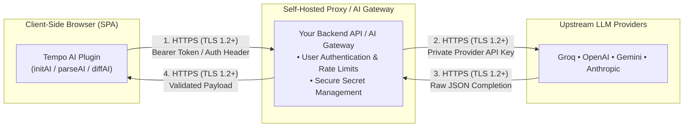

# Provider Architecture & Security

The `@magmacomputing/tempo-plugin-ai` plugin is designed to be highly flexible, supporting both direct Bring Your Own Key (BYOK) integrations for backend systems, and Proxied integrations for frontend clients.

## Bring Your Own Key (BYOK)

For Node.js backends and Edge Workers, the simplest approach is to supply your raw API keys directly to the `initAI` function. 

```typescript
import { initAI } from '@magmacomputing/tempo-plugin-ai';

initAI({
  providers: [
    ...(process.env.GROQ_API_KEY ? [{ id: 'groq', key: process.env.GROQ_API_KEY }] : []),
    ...(process.env.GEMINI_API_KEY ? [{ id: 'gemini', key: process.env.GEMINI_API_KEY }] : []),
    ...(process.env.OPENAI_API_KEY ? [{ id: 'openai', key: process.env.OPENAI_API_KEY }] : [])
  ]
});
```

### Advanced Configuration (Custom Models & LLM Options)
By default, standard providers automatically map to their optimal APIs and default models. 
However, you can explicitly override URLs, models, and inject arbitrary LLM parameters (like `temperature`) for power-user control!

```typescript
initAI({
  providers: [
    // 1. Enterprise Azure OpenAI (via Entra ID Bearer token or backend proxy wrapper)
    // Note: BYOK requests send 'Authorization: Bearer <key>'. When connecting to Azure OpenAI,
    // supply an Entra ID bearer token as provider.key or route through an Azure API gateway.
    ...(process.env.AZURE_ENTRA_BEARER_TOKEN ? [{ 
      id: 'openai', 
      key: process.env.AZURE_ENTRA_BEARER_TOKEN,
      url: 'https://my-enterprise.openai.azure.com/v1/chat/completions',
      model: 'your-enterprise-model',
      options: { temperature: 0.2, seed: 42 }
    }] : []),
    // 2. Local Open-Source Models (e.g. Ollama)
    { 
      id: 'local', 
      key: 'no-key-needed',
      url: 'http://localhost:11434/v1/chat/completions',
      model: 'your-local-model',
      options: { timeout: 5000 } // Custom provider-level timeout (5s)
    }
  ]
});
```

### Dynamic Provider Manifests & Remote Endpoint Trust

By default, `@magmacomputing/tempo-plugin-ai` lazily fetches provider defaults (model IDs, endpoints, token parameter keys) from `https://tempo.magmacomputing.com.au/providers.v1.json` once per application lifecycle.

- **Remote Manifest Trust & Endpoint Enforcement**:
  - `remoteConfigUrl` is restricted to fixed trusted hosts (`tempo.magmacomputing.com.au` or trusted internal HTTPS endpoints).
  - Any dynamic `provider.url` values received from the manifest or dynamically returned via `fetchDefaults` are strictly validated against an enforced provider host allowlist (or must use verified HTTPS/localhost origins) before `getResolvedProviderDefaults()` merges them into runtime provider configurations. Untrusted or unauthenticated endpoints are rejected and stripped before merging.
- **Validation on `fetchDefaults` Hook**: The exact same host allowlist and HTTPS origin verification is enforced when resolving custom provider options via the `fetchDefaults` callback. Any dynamic hook attempting to return unauthenticated or disallowed host URLs will have the `url` property safely discarded.
- **Async Resolution & Promise Lifecycle**: `initAI()` returns a `Promise<void>`.
  - **Synchronous Fire-and-Forget**: Calling `initAI(...)` synchronously without `await` immediately initializes system state with compiled local provider defaults (`DEFAULT_PROVIDERS`). You can execute `parseAI()` immediately on the next line without blocking. The remote manifest is fetched in the background and transparently updates provider defaults once received.
  - **Guaranteed Remote Resolution**: If your application strictly requires remote provider defaults to be resolved before executing your first AI request, you can `await initAI(...)`:
    ```typescript
    // Await guaranteed remote manifest completion before proceeding
    await initAI({
      providers: [{ id: 'groq', key: process.env.GROQ_API_KEY! }]
    });
    ```
- **Fail-Open & Air-Gapped Fallback**: If the network request fails, times out (1500ms limit), or the application is running offline or in an air-gapped environment, `initAI()` automatically and silently falls back to compiled local defaults (`DEFAULT_PROVIDERS`).
- **Disabling Remote Manifest**: Pass `remoteConfigUrl: false` to disable remote manifest fetching entirely:
  ```typescript
  initAI({
    providers: [{ id: 'groq', key: process.env.GROQ_API_KEY! }],
    remoteConfigUrl: false // Disable remote manifest fetching
  });
  ```

### Frontend Security Warning
> [!CAUTION]
> **Never** expose a raw LLM API key in a client-side browser bundle (like React, Vue, or Svelte) or store it in browser storage (`localStorage`, `sessionStorage`, `IndexedDB`, or browser cache). Any Cross-Site Scripting (XSS) vulnerability, compromised NPM dependency, or malicious browser extension can inspect client-side memory/storage and extract secret keys, leading to quota drainage, unexpected billing spikes, or account bans. BYOK provider keys are *only* safe on backend servers and edge workers.

## Browser & Client-Side Proxy Architecture

To execute AI functions within client-side browser applications safely, route requests through a secure self-hosted backend proxy or unified AI Gateway (such as a Cloudflare Worker, Next.js API route, Express server, OpenRouter, Portkey, or LiteLLM):



### 1. Browser Configuration Example
Configure `initAI` in your browser code to target your backend proxy or AI Gateway URL:

```typescript
import { initAI, parseAI } from '@magmacomputing/tempo-plugin-ai';

// Safe for browser deployment: No private LLM API keys are bundled
await initAI({
  providers: [
    {
      id: 'my-gateway',
      url: 'https://api.mycompany.com/v1/ai/chat/completions', // Your secure proxy endpoint
      key: userSessionToken, // Short-lived user Bearer JWT token
      model: 'llama-3.3-70b-instruct'
    }
  ]
});

// All Tempo AI functions now execute securely through your proxy
const date = await parseAI("Team standup next Wednesday at 9:30am");
```

### 2. Backend Proxy Handler Example (Next.js / Cloudflare Worker / Express)
Your backend endpoint receives the request, validates the user's session, enforces ingress quotas, attaches your private LLM API key, and forwards the validated payload to the upstream provider:

```typescript
// Example: Next.js API Route / Cloudflare Worker / Express Proxy Handler
export async function POST(req: Request, env?: { GROQ_API_KEY?: string }) {
  // 1. Authenticate user session
  const authHeader = req.headers.get('Authorization');
  const session = await validateUserSession(authHeader);
  if (!session) {
    return new Response('Unauthorized', { status: 401 });
  }

  // 2. Ingress validation & per-user quota enforcement
  const body = await req.json();
  if (typeof body?.prompt !== 'string' || body.prompt.length > 4096) {
    return new Response('Invalid prompt or payload exceeds size limit', { status: 400 });
  }
  if (!checkUserRateLimit(session.userId)) {
    return new Response('Too Many Requests', { status: 429 });
  }

  // 3. Resolve API key (Cloudflare Worker env binding or Node/Next.js process.env)
  const apiKey = env?.GROQ_API_KEY || (typeof process !== 'undefined' ? process.env?.GROQ_API_KEY : undefined);
  if (!apiKey) {
    return new Response('Provider key configuration missing', { status: 500 });
  }

  // 4. Construct upstream fetch with bounded timeout and cleanup
  const controller = new AbortController();
  const timeoutId = setTimeout(() => controller.abort(), 10000); // 10s upstream limit

  try {
    const upstreamResponse = await fetch('https://api.groq.com/openai/v1/chat/completions', {
      method: 'POST',
      headers: {
        'Content-Type': 'application/json',
        'Authorization': `Bearer ${apiKey}`
      },
      body: JSON.stringify({
        model: 'llama-3.3-70b-versatile',
        messages: body.messages,
        temperature: 0.1,
      }),
      signal: controller.signal
    });

    // 5. Return provider payload to client
    const data = await upstreamResponse.json();
    return new Response(JSON.stringify(data), {
      status: upstreamResponse.status,
      headers: { 'Content-Type': 'application/json' }
    });
  } catch (err: any) {
    if (err.name === 'AbortError' || controller.signal.aborted) {
      return new Response(JSON.stringify({ error: 'Upstream provider gateway timeout' }), {
        status: 504,
        headers: { 'Content-Type': 'application/json' }
      });
    }
    return new Response(JSON.stringify({ error: 'Upstream connection failure' }), {
      status: 502,
      headers: { 'Content-Type': 'application/json' }
    });
  } finally {
    clearTimeout(timeoutId);
  }
}
```

---

## 🔒 Security & Privacy Guarantees

Whether running directly on backend servers (Node.js, Deno, Bun, Edge Workers) or through a client-side browser proxy, `@magmacomputing/tempo-plugin-ai` enforces strict security and privacy standards:

### 1. Transport Security (HTTPS / TLS)
All network communication—both from client to proxy and from proxy/server to upstream LLM endpoints—is required over HTTPS. Negotiated TLS versions (such as TLS 1.2 or TLS 1.3) depend on deployment environment and server configuration unless strictly enforced by your reverse proxy. Plaintext HTTP endpoints are disallowed in production environments (permitted only on `localhost` during local development).

### 2. Ephemeral Processing & Cache Retention Controls
Temporal processing payloads (dates, times, context snippets, prompts) are processed ephemerally. The plugin does not send telemetry or store user prompt data on external analytics servers. However, functions supporting caching (e.g. `parseAI`, `formatAI`, `diffAI`) may retain prompt-derived cache keys and final results in local memory or configured custom cache adapters according to the resolved TTL. Requests requiring zero cache retention must explicitly pass `cache: false`.

### 3. In-Memory Credential Redaction & Immutability
* **Automated Key Redaction**: Calling `getAiConfig()` returns a sanitized, deeply read-only snapshot of active configurations with all provider `key` values replaced with `[REDACTED]`, preventing accidental exposure in log files, APM traces, or crash dumps.
* **Frozen Metadata**: All diagnostic metadata attached to `Tempo` instances via `.ai` is deeply frozen with `Object.freeze()` and guarded via runtime `Proxy` wrappers, protecting against direct runtime mutation of the `.ai` metadata.

### 4. Deterministic Schema Guardrails & Confidence Range Verification
All LLM prompts are paired with rigid, machine-verifiable JSON schemas. Responses undergo strict boundary validation, regex parsing, confidence range verification (`0.0` to `1.0`), and ISO verification before any native `Tempo` date object or result payload is instantiated. If an LLM returns malformed, out-of-range, or non-chronological data, the plugin throws a typed `TempoAiError` or triggers automatic fallback rather than silently returning an invalid date.

### 5. Partitioned Caching & Fail-Open Storage Resilience
* **Strict Cache Key Partitioning**: Caches are namespaced and hashed (`ai:<namespace>::...`) with timezone, locale, calendar, and anchor date isolation to prevent cross-tenant or cross-regional cache poisoning.
* **Fail-Open Protection**: If a custom distributed cache adapter (e.g. Redis or Cloudflare KV) encounters network disruption or errors, the plugin automatically fails open to direct LLM resolution, preserving application uptime.

## Multi-Provider Execution Strategies (`AiMode`)

Because third-party APIs can experience downtime, latency spikes, or quota exhaustion, `@magmacomputing/tempo-plugin-ai` provides six dedicated dispatch strategies configured via `AiMode` (or string literals):

| Strategy | Enum (`AiMode`) | Primary Advantage | Typical Use Case |
| :--- | :--- | :--- | :--- |
| **Fallback** *(Default)* | `AiMode.Fallback` | Minimum token cost (sequential cascade) | Default production baseline & background tasks |
| **Hedged** | `AiMode.Hedged` | Ultra-fast latency with low token overhead (~1.15x) | Latency-sensitive interactive search & chatbots |
| **RoundRobin** | `AiMode.RoundRobin` | Cyclic rotation across multi-key pools | High-throughput batch ingestion across API keys |
| **Adaptive** | `AiMode.Adaptive` | Telemetry-driven rate-limit avoidance | Multi-tier provider pools with mixed quotas |
| **Race** | `AiMode.Race` | Absolute minimum response latency | Real-time typeahead & autocomplete |
| **Consensus** | `AiMode.Consensus` | Cross-LLM verification & hallucination trapping | High-stakes legal, financial, and contract dates |

👉 For detailed architecture breakdowns, Mermaid decision trees, and configuration guides for each mode, see the **[Multi-Provider Execution Modes Guide (`modes.md`)](./modes.md)**.

### Provider ID Canonicalization
Provider IDs are normalized case-insensitively during `initAI` lookup (e.g. `'Gemini'`, `'gemini'`, `'OpenAI'`), automatically applying default endpoints and models while preserving the caller's registered identifier for logging and metadata.
