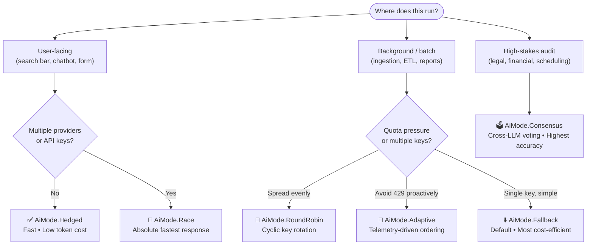

# Multi-Provider Execution Modes (`AiMode`)

`@magmacomputing/tempo-plugin-ai` provides a robust, multi-provider dispatch orchestrator that handles latency hedging, quota load-balancing, consensus verification, and fault-tolerant failovers across diverse LLM providers (e.g. OpenAI, Anthropic, Groq, Mistral, Google Gemini, Ollama, local vLLM).

Execution modes can be configured globally during plugin initialization or overridden per request:

```typescript
import { initAI, parseAI, AiMode } from '@magmacomputing/tempo-plugin-ai';

// Global configuration
await initAI({
  providers: [
    { id: 'groq', key: process.env.GROQ_API_KEY },
    { id: 'openai', key: process.env.OPENAI_API_KEY }
  ],
  mode: AiMode.Hedged
});

// Per-request override
const dt = await parseAI('next friday at 3pm', {
  mode: AiMode.Adaptive
});
```

---

## Strategy Comparison

| Mode | Dispatch | Token Cost | Latency | Rate-Limit Resilience |
| :--- | :--- | :---: | :---: | :---: |
| **`Fallback`** *(Default)* | Sequential | 🟢 1 request | 🟡 Moderate | 🟡 Reactive |
| **`Hedged`** | Staggered (primary + timer) | 🟢 ~1.15 avg | 🟢 Ultra-Fast | 🟡 Reactive |
| **`RoundRobin`** | Cyclic rotation | 🟢 1 request | 🟡 Moderate | 🟢 High |
| **`Adaptive`** | Quota-sorted rotation | 🟢 1 request | 🟡 Moderate | 🟢 Maximum |
| **`Race`** | Full parallel | 🔴 N requests | 🟢 Ultra-Fast | 🟡 Reactive |
| **`Consensus`** | Full parallel + voting | 🔴 N requests | 🟡 Moderate | 🟡 Reactive |

---

## Dispatch Decision Guide




---

## Mode Deep-Dives & Code Examples

### 1. `AiMode.Fallback` — Sequential Cascade *(Default)*

Dispatches requests to providers sequentially in configured order until a provider succeeds and satisfies `minConfidence`. The most cost-efficient mode.

**Best for:** Standard production baseline — general date parsing and background tasks.

```typescript
const dt = await parseAI('first monday in october 2026', {
  mode: AiMode.Fallback,
  minConfidence: 0.85 // Automatically cascades to next provider if score is too low
});
```

---

### 2. `AiMode.Hedged` — Speculative Latency Hedging

Sends a request to the primary provider immediately. If no valid response arrives within `hedgeDelay` (default: `800ms`), launches a speculative concurrent request to the secondary provider. The first valid response wins; all in-flight requests are aborted.

**Best for:** Latency-sensitive user-facing APIs — search bars, chatbots, web forms.

```typescript
const dt = await parseAI('schedule team sync for next wednesday at 2pm', {
  mode: AiMode.Hedged,
  hedgeDelay: 600 // Launch hedge after 600ms if primary is still pending
});
```

> [!TIP]
> `hedgeDelay` can also be set globally in `initAI({ hedgeDelay: 600 })` so it applies to all functions (`parseAI`, `recurrenceAI`, `scheduleAI`).

---

### 3. `AiMode.RoundRobin` — Multi-Key Cyclic Load Balancing

Cycles through the configured provider pool on each invocation (`0 → 1 → 2 → 0 ...`). If the selected starting provider fails, automatically falls over to the remaining providers in cyclic order.

**Best for:** High-throughput batch processing — ingesting large volumes of dates across multiple API keys to avoid single-account RPM throttling.

```typescript
await initAI({
  providers: [
    { id: 'groq-key-1', key: process.env.GROQ_KEY_1 },
    { id: 'groq-key-2', key: process.env.GROQ_KEY_2 },
    { id: 'groq-key-3', key: process.env.GROQ_KEY_3 }
  ],
  mode: AiMode.RoundRobin
});
```

---

### 4. `AiMode.Adaptive` — Rate-Limit Telemetry Prioritization

Reads `x-ratelimit-*` HTTP headers after every provider response and stores per-provider quota snapshots. On the next request, providers with `remainingRequests === 0` in an active reset window are automatically deprioritized; remaining providers are sorted by highest available quota.

**Best for:** Multi-tier production gateways — mixed free/paid provider pools where proactively avoiding `429 Too Many Requests` is essential.

```typescript
const dt = await parseAI('quarterly review deadline next quarter', {
  mode: AiMode.Adaptive
});
```

> [!NOTE]
> Telemetry accumulates across calls. The first request in a session uses original provider order; sorting kicks in from the second call onward once header data is available.

---

### 5. `AiMode.Race` — Speculative Parallel Execution

Dispatches requests concurrently across all configured providers. The fastest successful response is returned, and all remaining requests are immediately cancelled via `AbortSignal`.

**Best for:** Real-time interactive typeahead — live search inputs or autocomplete where the fastest possible response is required regardless of token cost.

```typescript
const dt = await parseAI('tomorrow at noon', {
  mode: AiMode.Race
});
```

---

### 6. `AiMode.Consensus` — Multi-LLM Cross-Validation

Dispatches requests concurrently across all providers and compares the normalized ISO timestamps or RRULE strings. If all responding providers agree, confidence is elevated to `1.0` (unanimous). If providers disagree, the highest-confidence candidate is returned and flagged with `dt.ai.ambiguous = true`.

**Best for:** High-stakes legal, financial, and scheduling — contract dates, event conflict resolution, or auditing where hallucination prevention requires unanimous LLM agreement.

```typescript
const dt = await parseAI('contract renewal date', {
  mode: AiMode.Consensus
});

if (dt.ai?.ambiguous) {
  console.warn('Providers disagreed — treat this result with caution.');
}
```
