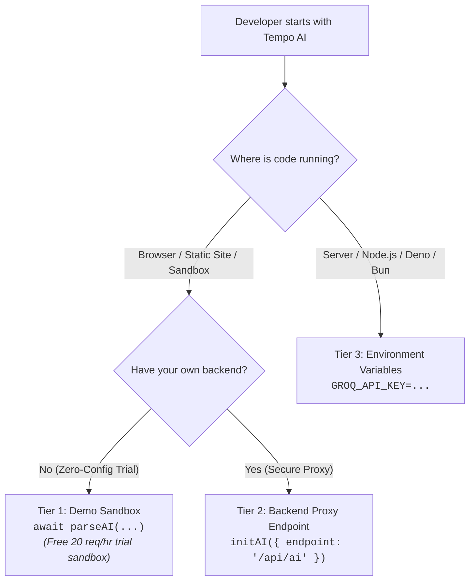

# AI Configuration & Onboarding Guide

Tempo provides two complementary parsing layers:
1. **Core Tempo Deterministic Engine**: Resolves standard dates, ISO strings, and regular relative expressions (e.g. `"tomorrow at 5pm"`, `"next Tuesday"`, `"3 days ago"`) instantly at zero token cost and zero network latency.
2. **Tempo AI Plugin**: Leverages LLMs for complex semantic reasoning, cultural calendars, event-anchored dates, and ambiguous colloquialisms (e.g. `"The Friday before Melbourne Cup"`, `"Third Thursday in November after Thanksgiving"`, `"First business day after Orthodox Easter"`).

---

## 3-Tier Configuration Architecture

Choose the setup that fits your environment:



### Tier Comparison Matrix

| Tier | Best For | Configuration | Rate Limits & Auth |
| :--- | :--- | :--- | :--- |
| **Tier 1: Demo Sandbox** | Rapid prototyping, browser REPL, onboarding tutorials | Zero setup required! Omit `initAI()` or call with no args. | Public trial sandbox: 20 req/hr per IP (Groq Llama 3.3). |
| **Tier 2: Backend Proxy** | Production web apps, mobile apps, SPAs | `initAI({ endpoint: '/api/ai' })` | Your backend manages quotas, authentication, and secret storage. |
| **Tier 3: Direct Keys** | Server-side APIs, microservices, CLI tools, serverless | Environment variables (`GROQ_API_KEY`, etc.) or `initAI({ providers: [...] })` | Full direct provider quota with dynamic key/endpoint supplier support. |

---

## Tier 1: Zero-Config Trial Sandbox

When you invoke `parseAI()`, `extractAI()`, or `diffAI()` without prior configuration or environment variables, Tempo AI automatically connects to the public Tempo demo sandbox.

```typescript
import { parseAI } from '@magmacomputing/tempo-plugin-ai';

// No API keys or setup needed!
const dt = await parseAI("The third Thursday in November after Thanksgiving");
console.log(dt.format());
```

> [!NOTE]
> The demo sandbox is rate-limited to **20 requests/hour per IP**. When exceeded, Tempo AI raises a descriptive `TempoAiError(429)` guiding you to Tier 2 or Tier 3.

---

## Tier 2: Backend Proxy (Recommended for Web Apps)

Never expose private LLM API tokens in client-side browser JavaScript. Instead, configure a single root proxy endpoint:

```typescript
import { initAI, parseAI } from '@magmacomputing/tempo-plugin-ai';

// Configure proxy endpoint once at app startup
initAI({
  endpoint: 'https://api.yourdomain.com/api/aiProxy'
});

// All subsequent AI calls route through your backend proxy:
const meeting = await parseAI("The last Friday before Melbourne Cup Day");
```

Your backend server (Express, Cloud Functions, Next.js API route) terminates client requests, attaches server-bound secrets, and forwards requests upstream:

```typescript
// Backend handler example (Firebase Cloud Function / Express)
export const handleAiProxy = async (req, res) => {
  const payload = req.body;
  
  const upstreamRes = await fetch('https://api.groq.com/openai/v1/chat/completions', {
    method: 'POST',
    headers: {
      'Authorization': `Bearer ${process.env.GROQ_API_KEY}`,
      'Content-Type': 'application/json'
    },
    body: JSON.stringify(payload)
  });

  const data = await upstreamRes.json();
  res.json(data);
};
```

---

## Tier 3: Direct Keys & Environment Variables (Server-Side)

### Method A: Environment Variables (Auto-Discovery)

In Node.js, Deno, or Bun environments, standard provider environment variables are detected automatically:

```bash
# In your .env or shell:
GROQ_API_KEY="gsk_..."
OPENAI_API_KEY="sk-..."
```

```typescript
import { parseAI } from '@magmacomputing/tempo-plugin-ai';

// Automatically discovers GROQ_API_KEY and OPENAI_API_KEY:
const result = await parseAI("Two weeks after our Q3 quarterly investor dinner");
```

### Method B: Explicit `initAI`

```typescript
import { initAI, AiMode } from '@magmacomputing/tempo-plugin-ai';

await initAI({
  mode: AiMode.Fallback,
  providers: [
    {
      id: 'groq',
      key: process.env.GROQ_API_KEY
    },
    {
      id: 'custom-internal-gateway',
      endpoint: 'https://ai-gateway.internal.corp/v1/chat/completions',
      key: () => getVaultSecret('gateway-token'), // Dynamic supplier
      model: 'llama-3.3-70b-versatile'
    }
  ],
  timeout: 5000
});
```

---

## Configuration Parameter Reference

| Parameter | Type | Description |
| :--- | :--- | :--- |
| `endpoint` | `string \| (() => string)` | Global backend proxy URL for all unconfigured providers. |
| `providers` | `AiProvider[]` | Array of configured AI providers. |
| `providers[].endpoint` | `string \| (() => string)` | Target chat completions API endpoint URL. |
| `providers[].key` | `string \| (() => string \| Promise<string>)` | Provider API key or dynamic async key resolver. |
| `providers[].model` | `string \| (() => string)` | Model identifier. |
| `mode` | `AiMode` | Execution strategy (`fallback`, `race`, `consensus`, `hedged`, `roundrobin`, `adaptive`). |
| `timeout` | `number` | SLA timeout in milliseconds (default: `15000`). |
| `cache` | `boolean \| CacheAdapter` | Cache configuration. |
