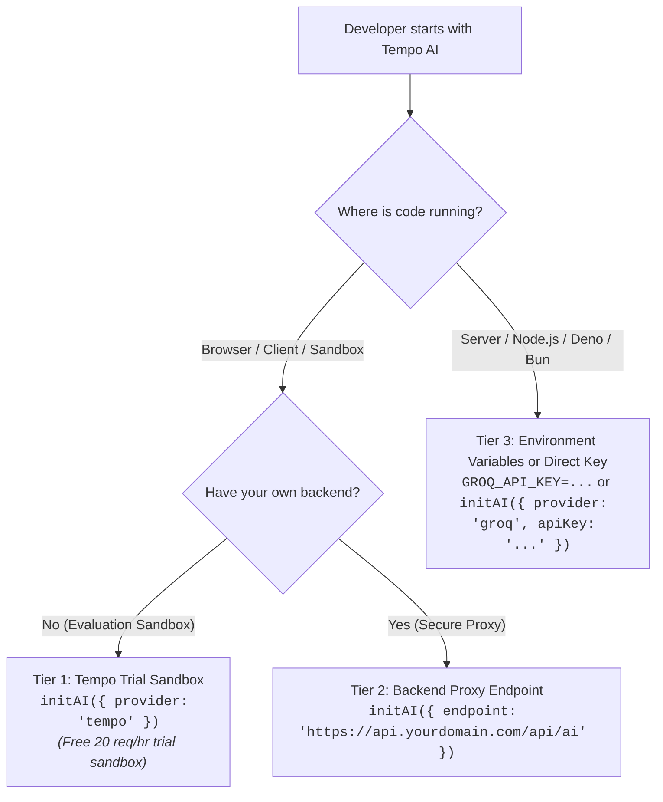

# AI Configuration & Onboarding Guide

Tempo provides two complementary parsing layers:
1. **Core Tempo Deterministic Engine**: Resolves standard dates, ISO strings, and regular relative expressions (e.g. `"tomorrow at 5pm"`, `"next Tuesday"`, `"3 days ago"`) instantly at zero token cost and zero network latency.
2. **Tempo AI Plugin**: Leverages LLMs for complex semantic reasoning, cultural calendars, event-anchored dates, and ambiguous colloquialisms (e.g. `"The Friday before Melbourne Cup"`, `"Third Thursday in November after Thanksgiving"`, `"First business day after Orthodox Easter"`).

---

## 3-Tier Configuration Architecture

Choose the setup that fits your environment:



### Tier Comparison Matrix

| Tier | Best For | Configuration | Rate Limits & Data Handling |
| :--- | :--- | :--- | :--- |
| **Tier 1: Tempo Sandbox** | Rapid prototyping, browser REPL, onboarding tutorials | `initAI({ provider: 'tempo' })` | Free community evaluation sandbox: 20 req/hr per IP (powered by a managed high-reasoning model). Queries are sanitized and retained for up to 30 days for prompt diagnostics. |
| **Tier 2: Backend Proxy** | Production web apps, mobile apps, SPAs | `initAI({ endpoint: 'https://api.yourdomain.com/api/ai' })` | Your backend manages quotas, authentication, and secret storage. Zero data touches Tempo servers. |
| **Tier 3: Direct Keys** | Server-side APIs, microservices, CLI tools, serverless | `initAI({ provider: 'groq', apiKey: '...' })` or `initAI({ providers: [...] })` | Full direct provider quota with dynamic key/endpoint supplier support. Direct client-to-provider egress. |

---

## Tier 1: Tempo Trial Sandbox (Evaluation)

To quickly explore semantic date parsing without provisioning external API keys or setting up a proxy backend, opt-in to the free Tempo trial sandbox:

```typescript
import { initAI, parseAI } from '@magmacomputing/tempo-plugin-ai';

// Initialize with Tempo's free evaluation sandbox
await initAI({ provider: 'tempo' });

const dt = await parseAI("The third Thursday in November after Thanksgiving");
console.log(dt.format());
```

> [!NOTE]
> **Attention: Trial Gateway Telemetry & Rate Limits**:
> The public Tempo trial evaluation gateway (`provider: 'tempo'`) collects pseudonymous, de-identified telemetry regarding sandbox usage (latency, error rates, model performance, token counts, and HMAC-SHA-256 salted IP hashes) to shape the plugin roadmap and improve parsing schemas.
>
> If you require strict zero data retention or do not wish to participate in trial sandbox diagnostics, configure your own secure backend proxy (Tier 2) or direct BYOK provider credentials (Tier 3).
> Learn more in our Security & Privacy guide:
> [https://magmacomputing.github.io/magma/doc/9-plugins/ai.security.html](https://magmacomputing.github.io/magma/doc/9-plugins/ai.security.html)
>
> **Trial Rate Limits**: The free sandbox enforces an IP rate limit of **20 requests/hour**. When exceeded, Tempo AI raises a descriptive `TempoAiError(429)` guiding you to Tier 2 or Tier 3. To continually improve prompt accuracy and diagnose parsing edge cases, queries sent through the free sandbox are scrubbed of credentials and personal identifiers and stored for up to 30 days. Do not submit sensitive personal information through the trial sandbox.

---

## Tier 2: Backend Proxy (Recommended for Web Apps)

Never expose private LLM API tokens in client-side browser JavaScript. Instead, configure a single root proxy endpoint:

```typescript
import { initAI, parseAI } from '@magmacomputing/tempo-plugin-ai';

// Configure proxy endpoint once at app startup
initAI({
  endpoint: 'https://api.yourdomain.com/api/aiProxy'
});

// All subsequent AI calls route through your backend proxy (unless a provider specifies an explicit per-provider endpoint override):
const meeting = await parseAI("The last Friday before Melbourne Cup Day");
```

Your backend server (Express, Cloud Functions, Next.js API route) terminates client requests, attaches server-bound secrets, forwards requests upstream with timeout and abort management, and handles client disconnects:

```typescript
// Backend handler example (Firebase Cloud Function / Express)
export const handleAiProxy = async (req, res) => {
  // 1. Authenticate caller (verify JWT / session token)
  const authHeader = req.headers.authorization;
  if (!authHeader?.startsWith('Bearer '))
    return res.status(401).json({ error: 'Unauthorized: Missing or invalid authentication token.' });

  // 2. Verify caller authorization and enforce caller-specific rate limits
  const user = await verifyUserSession(authHeader.split('Bearer ')[1]);
  if (!user)
    return res.status(403).json({ error: 'Forbidden: Caller not authorized for AI proxy routing.' });

  // 3. Configure AbortController with 15s timeout & client disconnect listener
  const controller = new AbortController();
  const timeoutId = setTimeout(() => controller.abort(), 15_000);
  const onClientDisconnect = () => controller.abort();
  res.on('close', onClientDisconnect);

  try {
    // 4. Forward sanitized payload upstream with server-side private key & signal
    const payload = req.body;
    const upstreamRes = await fetch('https://api.groq.com/openai/v1/chat/completions', {
      method: 'POST',
      headers: {
        'Authorization': `Bearer ${process.env.GROQ_API_KEY}`,
        'Content-Type': 'application/json'
      },
      body: JSON.stringify(payload),
      signal: controller.signal
    });

    const data = await upstreamRes.json();
    res.status(upstreamRes.status).json(data);
  } catch (err: any) {
    if (controller.signal.aborted) {
      if (res.writableEnded || res.headersSent) return;
      return res.status(504).json({ error: 'Gateway Timeout: Upstream AI inference timed out or client disconnected.' });
    }
    res.status(500).json({ error: `AI Proxy Error: ${err.message}` });
  } finally {
    clearTimeout(timeoutId);
    res.removeListener?.('close', onClientDisconnect);
  }
};
```

---

## Tier 3: Direct Keys & Environment Variables (Server-Side)

### Method A: Environment Variables (Auto-Discovery)

In Node.js, Deno, or Bun environments, standard provider environment variables are detected automatically:

```bash
# In your .env or shell:
GROQ_API_KEY="gsk_..."
OPENAI_API_KEY="sk-..."
```

```typescript
import { parseAI } from '@magmacomputing/tempo-plugin-ai';

// Automatically discovers GROQ_API_KEY and OPENAI_API_KEY:
const result = await parseAI("Two weeks after our Q3 quarterly investor dinner");
```

### Method B: Explicit `initAI`

```typescript
import { initAI, AiMode } from '@magmacomputing/tempo-plugin-ai';

await initAI({
  mode: AiMode.Fallback,
  providers: [
    {
      id: 'groq',
      key: process.env.GROQ_API_KEY
      // Automatically resolves default endpoint & latest model from DEFAULT_PROVIDERS / live manifest
    },
    {
      id: 'custom-internal-gateway',
      endpoint: 'https://ai-gateway.internal.corp/v1/chat/completions',
      key: () => getVaultSecret('gateway-token'), // Dynamic supplier
      model: 'gpt-4o-mini' // Optional: override or specify custom model identifier
    }
  ],
  timeout: 5000
});
```

> [!TIP]
> **Dynamic Manifest & Zero-Maintenance Model Defaults**:
> For standard providers (`groq`, `openai`, `gemini`), specifying `model` or `endpoint` is optional. Tempo AI automatically populates them from built-in `DEFAULT_PROVIDERS` and continuously synchronizes the latest optimal models at runtime via the remote provider manifest (`providers.v1.json`). Explicit model parameters are only required when overriding defaults or routing to private custom gateways.

---

## Configuration Parameter Reference

| Parameter | Type | Description |
| :--- | :--- | :--- |
| `endpoint` | `string \| (() => string)` | Global backend proxy URL for all unconfigured providers. |
| `providers` | `AiProvider[]` | Array of configured AI providers. |
| `providers[].endpoint` | `string \| (() => string)` | Target chat completions API endpoint URL. |
| `providers[].key` | `string \| (() => string \| Promise<string>)` | Provider API key or dynamic async key resolver. |
| `providers[].model` | `string \| (() => string)` | Model identifier. |
| `mode` | `AiMode` | Execution strategy (`fallback`, `race`, `consensus`, `hedged`, `roundrobin`, `adaptive`). |
| `timeout` | `number` | SLA timeout in milliseconds (default: `15000`). |
| `force` | `boolean` | Set to `true` to force fresh LLM fetches and bypass deterministic pre-parsing globally. |
| `cache` | `boolean \| CacheAdapter` | Cache configuration. |
| `telemetry` | `boolean` | Set to `false` to opt-out of anonymous usage telemetry (default: `true`). |
