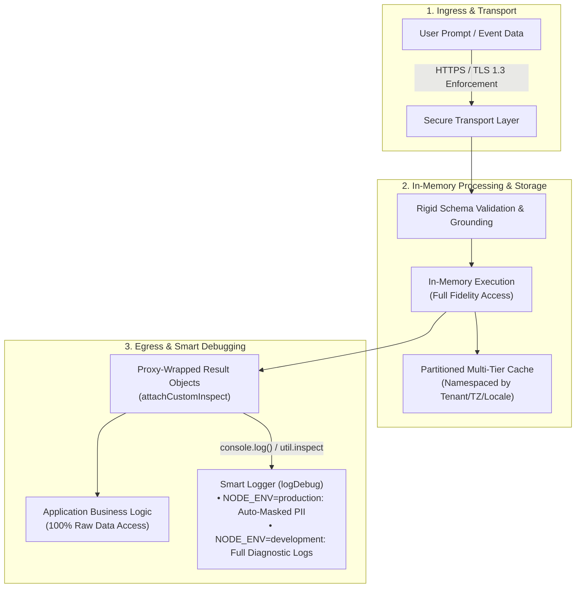

# Security & Privacy Architecture

The `@magmacomputing/tempo-plugin-ai` plugin is engineered with a **"Privacy and Security by Default"** philosophy. Because date parsing and calendar scheduling frequently interact with Personally Identifiable Information (PII)—such as meeting attendees, emails, phone numbers, and sensitive notes—the plugin incorporates multi-layered security controls to protect user data across transit, runtime memory, log output, and caching tiers.



---

## 1. Smart Debug Telemetry & PII Hardening

Debugging LLM integrations traditionally presents a major security dilemma: enabling debug logs often inadvertently dumps raw prompts containing sensitive user emails, phone numbers, and auth tokens into centralized log aggregators (e.g. Datadog, CloudWatch, Sentry).

`@magmacomputing/tempo-plugin-ai` significantly mitigates this risk through **Smart Debug Infrastructure**:

### Universal Environment Detection & Zero-Config Safety
* **Unified Flag**: Telemetry is enabled directly using `{ debug: true }` on individual requests or globally via `initAI({ debug: true })`.
* **Environment-Aware Sanitization**: The runtime automatically inspects `NODE_ENV`. In production environments (`NODE_ENV === 'production'`), all debug logs and terminal outputs automatically sanitize sensitive data before printing to `console.log` or `console.warn`.
* **Development Fidelity**: In non-production environments (local development, testing), full diagnostic strings are preserved for seamless prompt debugging.

### Automatic PII Redaction
In production mode, all debug telemetry is scrubbed through automated regex sanitizers:
* **Email Addresses**: Masked to initial and domain (e.g., `john.doe@enterprise.com` → `j***@enterprise.com`).
* **Phone Numbers**: Masked to last four digits (e.g., `+1-555-867-5309` → `***-***-5309`).
* **Bearer & API Tokens**: Redacted with prefix/suffix preservation (e.g., `Bearer sk-proj-1234...` → `Bearer sk-p...1234`).
* **Length Bounds**: Exceptionally long strings (> 256 characters) are safely truncated with character count annotations to prevent log bloat and denial-of-service attacks.

```typescript
import { parseAI, initAI } from '@magmacomputing/tempo-plugin-ai';

await initAI({
  providers: [{ id: 'groq', key: process.env.GROQ_API_KEY }],
  debug: true // Safe in all environments
});

// Input containing sensitive attendee data
const date = await parseAI("Meeting with john.smith@company.org (call 555-123-4567) next Friday");

// In Production, console.log(date.ai) outputs:
// {
//   provider: 'groq',
//   confidence: 0.98,
//   rawPrompt: 'Meeting with j***@company.org (call ***-***-4567) next Friday',
//   reasoning: 'Parsed meeting for next Friday with j***@company.org'
// }
```

---

## 2. Tamper-Resistant Proxy Introspection

All AI return objects (`Tempo.ai`, `TempoAiFormatResult`, `TempoAiExtractResult`, `TempoAiDiffResult`, `TempoScheduleResult`, `TempoRecurrenceResult`) utilize JavaScript `Proxy` wrappers and Node.js custom inspection hooks (`Symbol.for('nodejs.util.inspect.custom')` and `.toJSON()`):

1. **Terminal & Log Safety**: When an AI result object is logged via `console.log()`, `util.inspect()`, or serialized for telemetry, the custom inspection hook intercepts the call and outputs the PII-masked view.
2. **100% In-Memory Code Integrity**: In-memory property access within your application code (`date.ai?.rawPrompt`, `result.events[0].rawText`, `res.reasoning`) retains full, unmodified data fidelity.
3. **Deep Immutability**: Metadata properties attached to `Tempo` instances are frozen using `Object.freeze()`, preventing runtime tampering or prototype pollution by downstream code or dependencies.

```typescript
const result = await formatAI(targetDate, 'Notify alice.cooper@domain.com');

// 1. Terminal / Log Aggregators see sanitized PII in production:
console.log(result); 
// => { formatted: '...', reasoning: '... client a***@domain.com ...' }

// 2. Your application code receives full raw fidelity:
const rawReasoning = result.reasoning; 
// => "Formatted for client alice.cooper@domain.com"
```

---

## 3. Transport Security & Network Hardening

### Enforced HTTPS / TLS
* **Strict HTTPS Requirement**: All network communication with upstream LLM APIs and remote configuration servers must use HTTPS with modern TLS (TLS 1.2 or TLS 1.3).
* **Plaintext HTTP Disallowed**: Unencrypted HTTP endpoints are rejected at runtime, with an exception allowed exclusively for `localhost` origins during local development or unit testing with mock servers.

### Dynamic Manifest Host Verification
* **Trusted Remote Endpoints**: When `loadRemoteManifest` resolves provider manifests, it enforces trusted origin allowlists.
* **Provider URL Sanitization**: Any dynamic endpoint received via remote manifests or the `fetchDefaults` hook is verified before runtime merging. Disallowed hosts are rejected and stripped to prevent server-side request forgery (SSRF).

---

## 4. Credential Isolation & BYOK Architecture

### Automated In-Memory Key Redaction
* Calling `getAiConfig()` returns a sanitized, read-only configuration snapshot.
* All provider `key` values, authorization tokens, and shared secrets are permanently replaced with `[REDACTED]`, ensuring secrets cannot be leaked via diagnostic endpoints or error monitors.

### Dynamic Secret Vaults & Automated Key Rotation
* Provider `key` parameters support synchronous and asynchronous supplier functions (`AsyncEvaluable<string>` / `() => Promise<string> | string`), while `url`, `model`, and temporal context fields accept synchronous suppliers (`Evaluable<T>`).
* **Enterprise Secret Vaults**: Instead of pinning long-lived static API keys in memory, applications can integrate cloud key vaults (e.g. AWS Secrets Manager, HashiCorp Vault, Azure Key Vault, Doppler):
  ```typescript
  initAI({
    providers: [
      {
        id: 'openai',
        // Evaluated just-in-time on every provider HTTP dispatch
        key: async () => await secretVault.getSecret('OPENAI_API_KEY')
      }
    ]
  });
  ```
* **Multi-Tenant / Per-Request Key Isolation**: In SaaS applications where each tenant supplies their own BYOK credentials, resolve keys dynamically from the active request context without re-initializing global AI state:
  ```typescript
  initAI({
    providers: [
      {
        id: 'openai',
        // Pulls tenant-specific key from AsyncLocalStorage or request session
        key: () => {
          const tenant = tenantStore.getStore();
          if (!tenant) throw new Error('No tenant context found');
          return tenant.openaiApiKey;
        }
      }
    ]
  });
  ```
* **Short-Lived & OAuth Token Refreshers**: Dynamic suppliers allow automatic token refresh for short-lived credentials (e.g. Google Cloud Vertex AI / Azure Entra ID OAuth tokens) without service disruption:
  ```typescript
  initAI({
    providers: [
      {
        id: 'gemini',
        key: async () => (await authClient.getAccessToken()).token
      }
    ]
  });
  ```
* Keys are fetched just-in-time prior to the HTTP request and never stored in plain text in persistent global state, enabling zero-downtime key rotation.

### Frontend Zero-Storage Principle
* **No Client-Side Secrets**: LLM API keys must **never** be bundled into client-side single-page applications (React, Vue, Svelte) or stored in browser storage (`localStorage`, `sessionStorage`, `IndexedDB`).
* **Proxy Architecture**: Public frontend web applications must route requests through a self-hosted backend proxy or secure AI Gateway (Cloudflare Worker, Next.js API Route) where private API keys are kept server-side.

---

## 5. Ephemeral Processing & Partitioned Caching

### Zero External Telemetry Policy
* The plugin does not transmit telemetry, analytics, or prompt logs to external tracking servers.
* Prompt processing and temporal computations occur ephemerally during request execution.

### Partitioned Multi-Tier Caching
* **Namespaced Cache Keys**: Cache keys are generated with multi-factor domain partitioning (e.g., `diff::`, `format::`, `extract::`) incorporating the prompt text, anchor epoch, target timezone, locale, calendar system, and regional parameters to prevent contextual collision.
* **Storage Lifecycle**: Cached entries persist in the local `Tempo.cache` (`BoundedCache`) or caller-provided `AiCacheAdapter` (e.g. Redis, KV) strictly until TTL expiration or LRU capacity eviction.
* **Granular Bypass Controls**: Operations requiring zero cache persistence can supply `cache: false` or `force: true` on any individual request, or programmatically flush entries using `await aiCache.clear()`.

---

## 6. Schema Enforcement & Hallucination Defense

Large Language Models can occasionally hallucinate dates or output non-deterministic formats. `@magmacomputing/tempo-plugin-ai` prevents invalid data propagation through strict input/output boundaries:

1. **Rigid Schema Validation**: All provider completions are validated against deterministic schemas and regex patterns prior to object construction.
2. **Confidence Threshold Gating**: The plugin enforces configurable `minConfidence` thresholds (e.g. `minConfidence: 0.85`). Results falling below the threshold throw a typed `TempoAiError` or trigger automatic fallback.
3. **Deterministic Grounding Fallbacks**: Grounding metrics (such as business days, calendar day offsets, and duration calculations) are verified using deterministic `Tempo` calculations rather than unverified LLM assumptions.

---

## 7. Residual Risks & Threat Model Matrix

> [!IMPORTANT]
> **Primary Production Strategy**: The primary recommendation for production environments is to keep **`debug: false`** (the default). Smart Debug is designed as an automated safety net to prevent catastrophic PII leaks when developers troubleshoot live issues, but no automated sanitization layer can eliminate 100% of risk when raw diagnostic telemetry is captured.

The following matrix documents residual threat vectors and recommended mitigations:

| Threat Vector | Source | Risk Level | Architectural Behavior | Recommended Mitigation |
| :--- | :--- | :---: | :--- | :--- |
| **Direct Primitive Logging** | Developer `console.log(res.reasoning)` | Medium | Evaluates to the raw in-memory string and bypasses object inspection hooks. | Log entire result objects (`console.log(res)`) or leave `debug: false`. |
| **Object Spread Logging** | `console.log({ ...res })` | Low | Spreading copies raw enumerable keys into a plain object without non-enumerable inspect symbols. | Log the object directly (`console.log(res)`) rather than shallow spreading. |
| **Network-Layer APM Tracing** | Datadog, OpenTelemetry, Sentry HTTP capture | High | APM agents monkey-patching `fetch` capture raw outbound HTTP payloads in transit. | Disable full HTTP body capture on LLM routes in your APM configuration. |
| **Semantic PII** | Unstructured names, physical addresses, health info | Medium | Regexes catch structured PII (emails, phones, tokens) but not unstructured names/addresses. | Rely on payload truncation limits (< 256 chars) and avoid `debug: true` on sensitive workflows. |
| **Environment Variable Drift** | `NODE_ENV` not set or misconfigured | Low | Logger checks `NODE_ENV` (`production`, `prod`, `live`) and `PROD=true`. If unset, defaults to dev mode. | Verify deployment manifests explicitly export `NODE_ENV=production`. |
| **External Cache Driver Logs** | Third-party Redis/DB client debug logs | Low | Distributed cache adapters store raw JSON required to rehydrate `Tempo` instances. | Ensure production Redis/database clients have debug logging disabled. |

