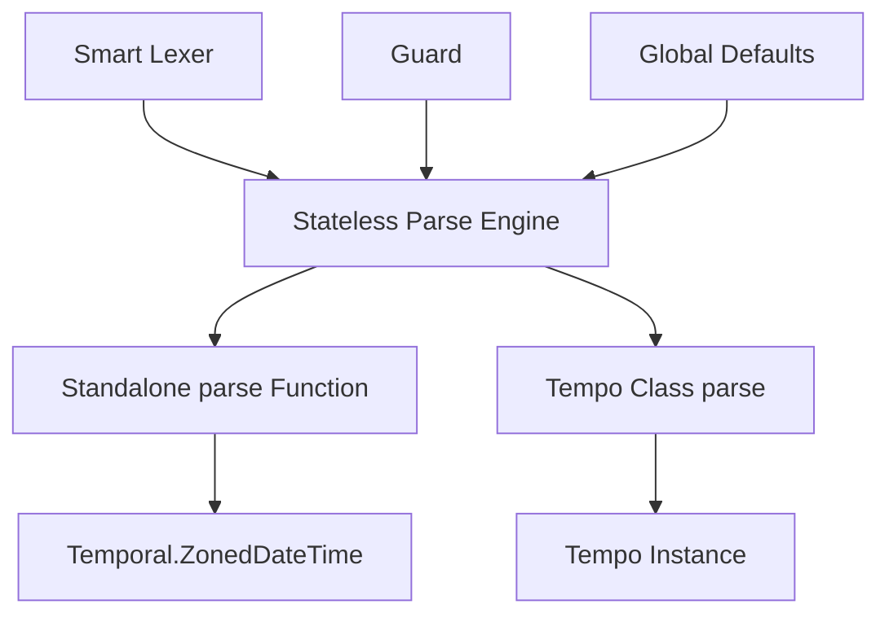

# Feasibility Analysis: Standalone `parse()` Function

This document outlines the architectural changes required to support a standalone `parse` function in a future release of Tempo, allowing users to leverage the "Smart Parser" without necessarily using the full `Tempo` class.

## 1. Current State
Currently, the `ParseModule` is designed as a **Plugin**.
- **Context Dependent**: It relies on `this` being a `Tempo` instance to access internal state (`parseDepth`, `errored`, `isValid`) and configuration (`timeZone`, `locale`).
- **Internal Coupling**: It uses `this[sym.$Internal]()` to retrieve the private state bucket.
- **Return Type**: It returns a `Temporal.ZonedDateTime`, which the `Tempo` constructor then uses to hydrate the instance.

## 2. Proposed Standalone Signature
```typescript
import { parse } from '@magmacomputing/tempo/parse';

// Standalone usage (returns a native Temporal.ZonedDateTime)
const zdt = parse('20-May', { 
    timeZone: 'Africa/Cairo',
    mode: 'strict' 
});
```

## 3. Implementation Feasibility

### A. Stateless Lexing (High Feasibility)
The core lexing logic (`module.lexer.ts`) is already highly modular. Functions like `parseWeekday`, `parseDate`, and `parseTime` are pure or near-pure. They could easily be adapted to take an explicit `options` object instead of relying on an instance config.

### B. Refactoring the Engine (Medium Feasibility)
To make `ParseEngine.parse` standalone, we would need to:
1.  **Lift State**: Instead of using `this[sym.$Internal]()`, the engine would accept a `State` object as an argument (or initialize a transient one).
2.  **Parameterize Config**: Pass `timezone`, `locale`, and `formats` as an explicit options object.
3.  **Functional Composition**: The logic in `module.composer.ts` (which assembles the final date) is already functional and would require minimal changes.

### C. Challenges & Trade-offs
1.  **Circular Dependencies**: If the standalone `parse` function were to return a `Tempo` instance (convenience wrapper), it would create a circular dependency with `tempo.class.ts`. To avoid this, it should strictly return `Temporal.ZonedDateTime`.
2.  **Global Defaults**: A standalone function wouldn't automatically respect `Tempo.init()` defaults unless it explicitly looked them up from the global registry (e.g. `REGISTRY.defaults`).
3.  **Validation (The Guard)**: The standalone function MUST include the `Guard` validation logic to ensure that inputs are sanitized and valid before attempting lexing.
4.  **Forced Strict Mode**: For standalone parsing, it is recommended to force `mode: 'strict'`. This prevents the parser from "guessing" or returning partial dates when the input is ambiguous, ensuring deterministic results for native Temporal users.

## 4. Proposed Architecture for Future Release



## 5. Conclusion
Implementing a standalone `parse` function is **Highly Feasible**. 
- Refactoring the `ParseEngine` to be stateless (accepting config/state as arguments) is the first step toward decoupling the parser.
- A wrapper `parse()` function will then be exported from `#tempo/parse` to provide a dedicated standalone entry point.
- Finally, `Tempo.class` will be updated to delegate its internal `#parse` logic to this shared stateless engine.

This would allow Tempo to serve as a high-performance "Natural Language to Temporal" parser for users who prefer the native Temporal API but want the "Slick" parsing capabilities of Tempo.
